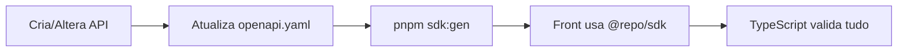

# ETijucas Monorepo Architecture

> **Guia rápido de regras e convenções para manter o projeto organizado e escalável.**

## Estrutura

```
etijucas/
├── apps/
│   ├── api/        # Laravel - Backend, Auth, Integrações
│   └── web/        # React/Vite - Frontend PWA
├── packages/
│   ├── sdk/        # Cliente API gerado do OpenAPI
│   └── shared/     # Types/Enums de UI compartilhados
├── contracts/
│   └── openapi.yaml  # Contrato da API (fonte da verdade)
└── tools/
    └── generate-sdk.js  # Geração automática do SDK
```

---

## Ferramentas de Dev

- `tools/generate-sdk.js` gera tipos do SDK a partir do OpenAPI
- `tools/make-feature.js` cria a estrutura basica de feature
- `tools/make-crud.js` gera CRUD completo (back + front + contrato)
- `tools/generate-mocks.js` gera handlers MSW a partir do OpenAPI
- `tools/sync-msw-worker.js` copia `mockServiceWorker.js` para `apps/web/public`

## Regras Fundamentais

### 1️⃣ API é a Fonte da Verdade

- Toda lógica de negócio fica no **backend** (`apps/api`)
- Validações críticas são feitas no backend, nunca só no front
- O frontend apenas exibe e coleta dados

### 2️⃣ Contrato Explícito via OpenAPI

- Todo endpoint que o front usa **DEVE** estar em `contracts/openapi.yaml`
- Rode `pnpm sdk:gen` após mudanças na API
- O build quebra se o contrato mudar incompativelmente ✅

### 2.1️⃣ Build do Frontend em Producao

- O build do React sai em `apps/api/public/app`
- O Laravel serve a SPA via `apps/api/public/.htaccess` (fallback + assets)
- URLs como `/assets/*`, `/manifest.json` e `/sw.js` precisam resolver para `/app/*`

### 3️⃣ Sem `fetch` Direto no Frontend

```typescript
// ❌ ERRADO - fetch direto
const res = await fetch('/api/v1/events');

// ✅ CERTO - usar SDK tipado
import { createApiClient } from '@repo/sdk';
const api = createApiClient({ baseUrl: '/api' });
const events = await api.events.list();
```

### 4️⃣ Separação de Types

| Origem | Pacote | Exemplo |
|--------|--------|---------|
| API (dados) | `@repo/sdk` | `User`, `Event`, `Bairro` |
| UI only | `@repo/shared` | `LoadingState`, `ModalSize` |

### 5️⃣ Integrações Externas só no Backend

```
✅ apps/api/app/Services/WhatsApp/
✅ apps/api/app/Services/Payments/
❌ apps/web/src/services/stripe.ts  # NUNCA!
```

---

## Comandos

| Comando | Descricao |
|---------|-----------|
| `pnpm dev` | Roda API e Web em paralelo |
| `pnpm api:dev` | So a API Laravel |
| `pnpm web:dev` | So o frontend React |
| `pnpm build` | Build de todos os packages |
| `pnpm lint` | Lint em todos os packages |
| `pnpm sdk:gen` | Regenera SDK do OpenAPI |
| `pnpm web:build` | Build do frontend |
| `pnpm prod:build` | **SDK + Web build** (usar antes de deploy) |
| `pnpm deploy:prep` | Prepara tudo para deploy |
| `pnpm make:crud` | Gera CRUD completo (back + front + contrato) |
| `pnpm mocks:gen` | Gera handlers MSW do OpenAPI |
| `pnpm msw:init` | Copia mockServiceWorker.js para `apps/web/public` |

---
## Fluxo de Desenvolvimento



### Adicionando Novo Endpoint

1. Implemente no Laravel (`apps/api/routes/api.php`)
2. Documente em `contracts/openapi.yaml`
3. Rode `pnpm sdk:gen`
4. Importe e use no frontend via `@repo/sdk`

### Mocking (Frontend)

- Ative com `VITE_API_MOCK=1` em `apps/web/.env`
- Gere handlers com `pnpm mocks:gen`
- Copie o worker com `pnpm msw:init` (uma vez apos instalar deps)
### Adicionando Enum de UI

1. Crie em `packages/shared/src/enums/`
2. Exporte em `packages/shared/src/enums/index.ts`
3. Importe no frontend: `import { MyEnum } from '@repo/shared'`

---

## Setup Local

```bash
# Instalar dependências
pnpm install

# API (em apps/api)
composer install
cp .env.example .env
php artisan key:generate
php artisan migrate

# Rodar tudo
pnpm dev
```

---

## Vibecoding-Friendly 🎯

Este monorepo foi estruturado para facilitar o desenvolvimento assistido por IA:

- **Contrato explícito**: O OpenAPI mostra claramente o que a API oferece
- **SDK tipado**: Autocomplete mostra todos os métodos disponíveis
- **Separação clara**: Fácil entender onde cada código deve ficar
- **Erros de build**: Se algo quebrar, o TypeScript avisa imediatamente


