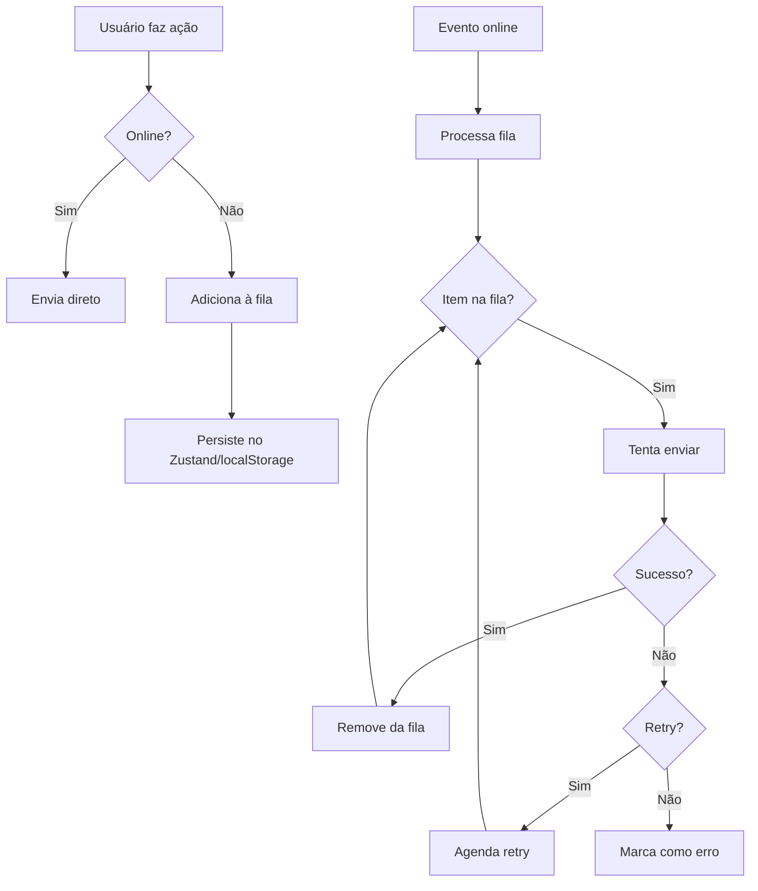

# Offline Sync - Políticas e Contratos

> Documentação das mutações offline, fila de sincronização e idempotency.

---

## 🔌 Visão Geral

O eTijucas é **offline-first**. Quando o usuário está sem internet:

1. ✅ Leitura: dados em cache (IndexedDB + React Query)
2. ✅ Escrita: mutações vão para **fila de sync**
3. ✅ Reconexão: fila processa automaticamente

---

## 📋 Mutações com Suporte Offline

| Endpoint | Método | Fila | Retry | Idempotency |
|----------|--------|------|-------|-------------|
| `/forum/topics` | POST | ✅ | 3x | `X-Idempotency-Key` |
| `/forum/topics/{id}/like` | POST | ✅ | ∞ | Automático (toggle) |
| `/forum/topics/{id}/comments` | POST | ✅ | 3x | `X-Idempotency-Key` |
| `/reports` | POST | ✅ | 5x | `X-Idempotency-Key` |
| `/events/{id}/rsvp` | POST | ✅ | 3x | Automático (user+event) |
| `/events/{id}/favorite` | POST | ✅ | ∞ | Automático (toggle) |

---

## 🔑 Idempotency Keys

### Como Funciona

```http
POST /api/v1/forum/topics
X-Idempotency-Key: 550e8400-e29b-41d4-a716-446655440099
Content-Type: application/json

{ "title": "Meu post", ... }
```

### Regras

1. **Cliente gera** UUID v4 antes de enviar
2. **Backend verifica** se key já foi processada (tabela `idempotency_keys`)
3. **Se existir**: retorna resposta original (sem reprocessar)
4. **Se não**: processa e guarda key + response por 24h

### Quando Usar

- ✅ Criação de recursos (POST que cria)
- ✅ Mutações que não são toggle
- ❌ Toggles (like/unlike, favorite/unfavorite) - são naturalmente idempotentes

---

## 📦 Estrutura da Fila (Frontend)

```typescript
// apps/web/src/store/useAppStore.ts (Zustand)
interface SyncQueueItem {
  id: string;                    // UUID local
  endpoint: string;              // /forum/topics
  method: 'POST' | 'PUT' | 'DELETE';
  payload: unknown;
  idempotencyKey?: string;       // Para POST
  retryCount: number;
  maxRetries: number;
  createdAt: string;
  lastError?: string;
  status: 'pending' | 'syncing' | 'error';
}
```

---

## ⚙️ Políticas de Retry

### Estratégia de Backoff

```typescript
const RETRY_DELAYS = [
  1000,    // 1s
  5000,    // 5s
  15000,   // 15s
  60000,   // 1min
  300000,  // 5min
];

function getRetryDelay(attempt: number): number {
  return RETRY_DELAYS[Math.min(attempt, RETRY_DELAYS.length - 1)];
}
```

### Quando Parar de Tentar

| Código HTTP | Ação |
|-------------|------|
| 2xx | ✅ Sucesso - remover da fila |
| 400, 422 | ❌ Erro de validação - marcar como `error`, não retry |
| 401 | 🔄 Tentar refresh token, depois retry |
| 403 | ❌ Sem permissão - marcar como `error` |
| 404 | ❌ Recurso não existe - marcar como `error` |
| 409 | ⚠️ Conflito (idempotency) - verificar se é duplicata |
| 5xx | 🔄 Retry com backoff |
| Network Error | 🔄 Retry quando voltar online |

---

## 🔄 Fluxo de Sincronização



---

## 🎨 UI/UX Offline

### Indicadores Visuais

| Estado | Badge/Cor | Ícone |
|--------|-----------|-------|
| Pendente | Amarelo | ⏳ |
| Sincronizando | Azul pulsante | 🔄 |
| Erro | Vermelho | ⚠️ |
| Sincronizado | Verde (some após 2s) | ✅ |

### Ações do Usuário

- **Ver detalhes**: Tap no badge mostra info do erro
- **Retry manual**: Botão "Tentar novamente"
- **Cancelar**: Swipe para deletar item da fila

---

## 🛠️ Backend: Implementação de Idempotency

### Migration

```php
Schema::create('idempotency_keys', function (Blueprint $table) {
    $table->uuid('key')->primary();
    $table->uuid('user_id')->nullable();
    $table->string('endpoint');
    $table->string('method', 10);
    $table->json('response')->nullable();
    $table->integer('status_code');
    $table->timestamp('created_at');
    $table->timestamp('expires_at');
    
    $table->index(['user_id', 'endpoint']);
});
```

### Middleware

```php
// app/Http/Middleware/IdempotencyMiddleware.php
public function handle($request, Closure $next)
{
    $key = $request->header('X-Idempotency-Key');
    
    if (!$key || !in_array($request->method(), ['POST', 'PUT'])) {
        return $next($request);
    }
    
    $existing = IdempotencyKey::where('key', $key)
        ->where('expires_at', '>', now())
        ->first();
    
    if ($existing) {
        return response()->json(
            $existing->response,
            $existing->status_code
        );
    }
    
    $response = $next($request);
    
    IdempotencyKey::create([
        'key' => $key,
        'user_id' => auth()->id(),
        'endpoint' => $request->path(),
        'method' => $request->method(),
        'response' => $response->getContent(),
        'status_code' => $response->getStatusCode(),
        'expires_at' => now()->addDay(),
    ]);
    
    return $response;
}
```

---

## 📊 Monitoramento

### Logs Estruturados

```php
Log::withContext([
    'request_id' => $requestId,
    'idempotency_key' => $key,
    'user_id' => auth()->id(),
])->info('Request processed', [
    'endpoint' => $request->path(),
    'status' => $response->getStatusCode(),
]);
```

### Métricas Sugeridas

- `sync_queue_size` - Tamanho da fila por usuário
- `sync_retry_count` - Número de retries
- `sync_error_rate` - Taxa de erros finais
- `idempotency_hit_rate` - Requests duplicados evitados
