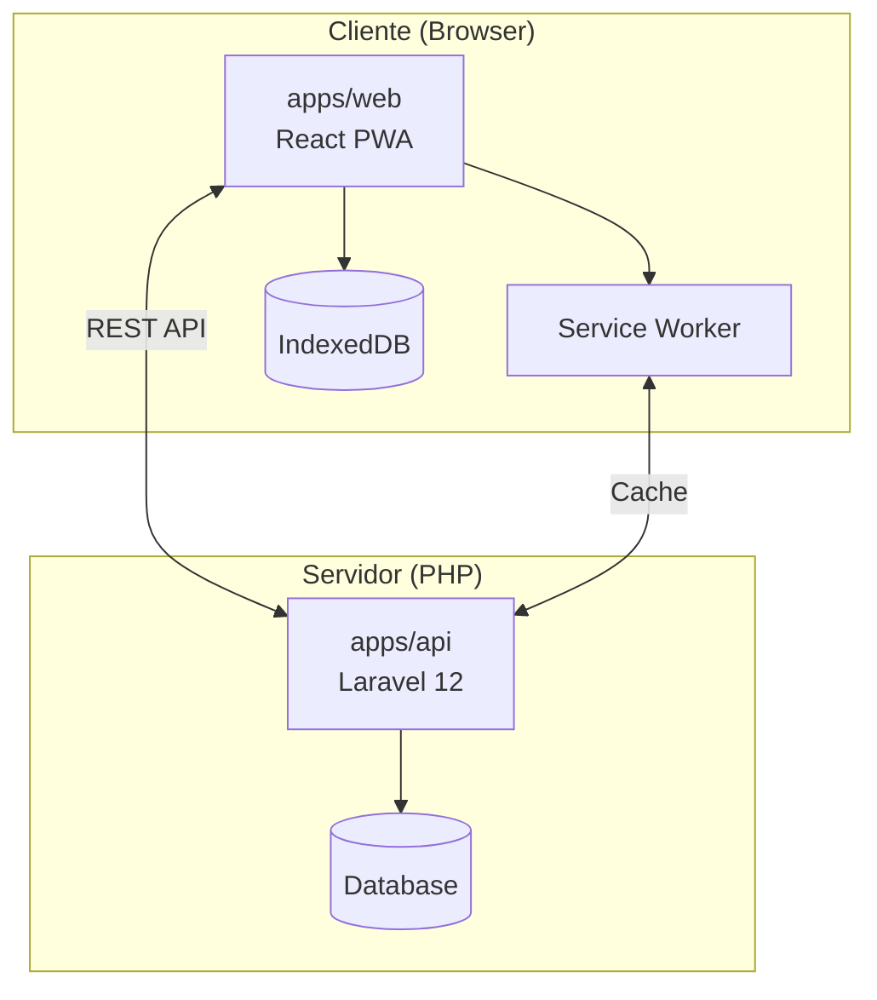

# 🏙️ ETijucas Monorepo

**ETijucas** é a plataforma digital de Tijucas/SC - um ecossistema completo com **API REST** (Laravel) e **PWA mobile-first** (React) para conectar cidadãos aos serviços da cidade.

> 🚀 **Status**: Produção | **Arquitetura**: Monorepo pnpm | **Deploy**: SPA estático + API Laravel

---

## 📁 Estrutura do Monorepo

```
etijucas/
├── apps/
│   ├── api/              # Backend Laravel 12
│   └── web/              # Frontend React + Vite PWA
├── packages/
│   ├── sdk/              # Cliente API tipado (opcional)
│   └── shared/           # Types/Enums de UI compartilhados
├── contracts/
│   └── openapi.yaml      # Contrato da API (fonte da verdade)
├── tools/
│   └── generate-sdk.js   # Gerador de tipos do OpenAPI
├── ARCHITECTURE.md       # Regras e convenções
├── DEPLOY.md             # Checklist de deploy
└── package.json          # Scripts do workspace
```

---

## 🛠️ Stacks

### Backend (`apps/api`)

| Tecnologia | Versão | Uso |
|------------|--------|-----|
| **PHP** | 8.2+ | Runtime |
| **Laravel** | 12 | Framework |
| **Sanctum** | 4.2 | Autenticação via tokens |
| **Filament** | 3.3 | Admin panel |
| **Spatie Permission** | 6.24 | RBAC (roles/permissões) |
| **Spatie Media Library** | 11.17 | Upload de imagens/avatars |
| **Spatie Query Builder** | 6.4 | Filtros para admin |
| **Z-API** | - | WhatsApp para OTP |

### Frontend (`apps/web`)

| Tecnologia | Versão | Uso |
|------------|--------|-----|
| **React** | 18.3 | UI framework |
| **TypeScript** | 5.8 | Type safety |
| **Vite** | 5.4 | Build tool & dev server |
| **Tailwind CSS** | 3.4 | Styling |
| **TanStack Query** | 5.83 | Data fetching & cache |
| **Zustand** | 5.0 | Global state (persisted) |
| **Framer Motion** | 12.29 | Animações |
| **Radix UI** | ~1.x | Componentes acessíveis |
| **Workbox** | 7.4 | Service Worker / PWA |

---

## 🎯 Features Principais

### API

| Módulo | Status | Descrição |
|--------|--------|-----------|
| **Auth** | ✅ | Login, registro, OTP via WhatsApp, refresh tokens |
| **Usuários** | ✅ | Perfil, avatar, preferências de notificação |
| **Bairros** | ✅ | Lista de bairros ativos |
| **Forum** | ✅ | Topics, comments, likes, reports |
| **Eventos** | ✅ | CRUD, filtros, RSVP, favoritos |
| **Admin** | ✅ | Listagem de usuários, roles, moderação |

### Frontend (PWA)

| Feature | Status | Descrição |
|---------|--------|-----------|
| **Offline-First** | ✅ | IndexedDB + Service Worker |
| **PWA Instalável** | ✅ | Funciona como app nativo |
| **Boca no Trombone** | ✅ | Fórum comunitário |
| **Denúncias** | ✅ | Wizard 5 passos com fotos |
| **Agenda de Eventos** | ✅ | Calendário interativo |
| **Telefones Úteis** | ✅ | Smart dialer com busca |
| **Missas** | ✅ | Horários por igreja |
| **Turismo** | ✅ | Pontos turísticos |
| **Coleta de Lixo** | ✅ | Horários por bairro |

---

## 🚀 Setup Rápido

### Requisitos

- **Node.js** 18+
- **pnpm** 9+
- **PHP** 8.2+
- **Composer** 2.x
- **MySQL** ou **SQLite**

### Instalação

```bash
# 1. Clone o repositório
git clone <repo-url> etijucas
cd etijucas

# 2. Instale pnpm (se necessário)
npm install -g pnpm

# 3. Instale dependências do workspace
pnpm install

# 4. Configure a API
cd apps/api
composer install
cp .env.example .env
php artisan key:generate
php artisan migrate --seed
php artisan storage:link
cd ../..

# 5. Rode tudo em paralelo
pnpm dev
```

---

## 📝 Scripts do Monorepo

| Comando | Descrição |
|---------|-----------|
| `pnpm dev` | Roda API + Web em paralelo |
| `pnpm api:dev` | Apenas API Laravel |
| `pnpm web:dev` | Apenas frontend React |
| `pnpm build` | Build de todos os packages |
| `pnpm prod:build` | **SDK + Web build** (usar antes de deploy) |
| `pnpm sdk:gen` | Regenera SDK do OpenAPI |
| `pnpm make:crud` | Gera CRUD completo (back + front + contrato) |
| `pnpm mocks:gen` | Gera handlers MSW do OpenAPI |
| `pnpm msw:init` | Copia mockServiceWorker.js para `apps/web/public` |
| `pnpm lint` | Lint em todos os packages |

---
## 🏗️ Arquitetura



### Fluxo de Dados

1. **Frontend** faz requests via `api/client.ts` (com retry, timeout, auth refresh)
2. **TanStack Query** gerencia cache e refetch
3. **Offline**: Mutações vão para fila, sincronizam ao reconectar
4. **API** valida e persiste no banco
5. **Responses** em JSON, transformados via Resources

### Regras do Monorepo

Veja [ARCHITECTURE.md](./ARCHITECTURE.md) para:
- API é fonte da verdade
- Contrato via `contracts/openapi.yaml`
- UI types em `packages/shared`
- Integrações externas só no backend

---

## Como o sistema funciona (na prática)

- O frontend é buildado com Vite e sai em `apps/api/public/app`
- O Laravel serve a SPA via `apps/api/public/.htaccess`, incluindo assets e fallback
- A API roda em `/api/v1` com Sanctum e resources padronizados
- O PWA usa Service Worker (Workbox) para cache e modo offline
- A base da API no front vem de `VITE_API_URL` (padrão `/api/v1`)
- Mocks locais usam MSW com `VITE_API_MOCK=1` e handlers do OpenAPI

## Melhorias recentes

- `pnpm make:crud` gera CRUD completo (back + front + contrato)
- MSW integrado com handlers gerados (`pnpm mocks:gen`) e worker sincronizado (`pnpm msw:init`)
- Ajuste de deploy para servir assets do SPA corretamente via Apache

---
## 📱 Deploy (Sem Node.js no servidor)

O frontend é buildado como SPA estático e servido pelo Laravel:

```bash
# 1. Build local
pnpm prod:build

# 2. Output vai para apps/api/public/app/
# 2.1 Apache deve servir assets da SPA (ver apps/api/public/.htaccess)

# 3. No servidor (só PHP):
cd apps/api
composer install --no-dev --optimize-autoloader
php artisan config:cache
php artisan route:cache
php artisan migrate --force
```

Veja [DEPLOY.md](./DEPLOY.md) para checklist completo.

---

## 🔧 API Endpoints

### Públicos

```
POST /api/v1/auth/login
POST /api/v1/auth/register
POST /api/v1/auth/send-otp
GET  /api/v1/bairros
GET  /api/v1/events
GET  /api/v1/forum/topics
```

### Autenticados

```
GET  /api/v1/auth/me
GET  /api/v1/users/me
PUT  /api/v1/users/me
POST /api/v1/users/me/avatar
POST /api/v1/forum/topics
POST /api/v1/events/{id}/rsvp
```

### Admin

```
GET    /api/v1/admin/users
PUT    /api/v1/admin/users/{id}
DELETE /api/v1/admin/users/{id}
POST   /api/v1/admin/users/{id}/roles
```

---

## 🚧 Melhorias Futuras

### Alta Prioridade

- [ ] **Push Notifications** - Alertas de eventos e updates de reports
- [ ] **Background Sync** - Sincronização com app fechado
- [ ] **OpenAPI Auto-Generation** - L5-Swagger ou Scramble no Laravel

### Média Prioridade

- [ ] **Mapas Interativos** - Mapa de reports e pontos turísticos
- [ ] **Login Social** - Google, Facebook
- [ ] **Geolocalização** - Detectar bairro automaticamente

### Baixa Prioridade

- [ ] **Multilíngua** - PT/EN/ES
- [ ] **E2E Tests** - Playwright
- [ ] **SDK Migration** - Migrar `api/client.ts` para `@repo/sdk` gradualmente

---

## 📚 Documentação Detalhada

| Documento | Descrição |
|-----------|-----------|
| [apps/api/README.md](./apps/api/README.md) | Documentação completa da API |
| [apps/web/README.md](./apps/web/README.md) | Documentação do frontend |
| [ARCHITECTURE.md](./ARCHITECTURE.md) | Regras e convenções do monorepo |
| [DEPLOY.md](./DEPLOY.md) | Checklist de deploy |
| [contracts/openapi.yaml](./contracts/openapi.yaml) | Especificação OpenAPI |
| [CONTRIBUTING.md](./CONTRIBUTING.md) | Guia para contribuidores |
| [CHECKLIST.md](./CHECKLIST.md) | Validação de qualidade |
| [SECURITY_AUDIT.md](./SECURITY_AUDIT.md) | Auditoria de segurança |
| [SSH_HOSTING_GUIDE.md](./SSH_HOSTING_GUIDE.md) | Guia SSH hospedagem |

---

## 📄 Licença

Código proprietário - Hype Neural

---

**Feito com ❤️ para Tijucas/SC**


