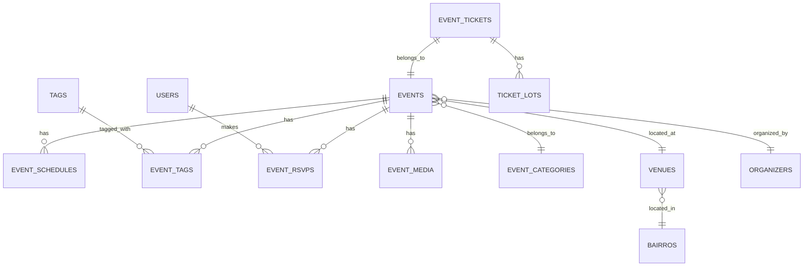

# 📅 Documentação Completa - API Agenda de Eventos

**Base URL:** `https://api.natalemtijucas.com.br/api/v1`  
**Última Atualização:** 31/01/2026  
**Status:** 🛠️ Sugestão de Implementação para o Backend

---

> [!CAUTION]
> **Status Atual dos Endpoints (31/01/2026)**
> 
> Os endpoints de eventos ainda **não estão implementados** no backend. Os testes retornaram:
> 
> ```
> SQLSTATE[42S02]: Base table or view not found: 1146 Table 'idespach_apietijucas.events' doesn't exist
> ```
> 
> **Ação Necessária:** Criar as tabelas conforme modelagem abaixo e implementar os controllers/routes.

---

## 📋 Índice

1. [Visão Geral](#-visão-geral)
2. [Modelagem do Banco de Dados](#-modelagem-do-banco-de-dados)
3. [Endpoints Sugeridos](#-endpoints-sugeridos)
4. [Schemas JSON](#-schemas-json)
5. [Filtros Disponíveis](#-filtros-disponíveis)
6. [Categorização de Eventos](#-categorização-de-eventos)
7. [Sistema de Tags](#-sistema-de-tags)
8. [Confirmação de Presença (RSVP)](#-confirmação-de-presença-rsvp)
9. [Programação do Evento](#-programação-do-evento)
10. [Redes Sociais e Links](#-redes-sociais-e-links)
11. [Eventos Dinâmicos](#-eventos-dinâmicos)
12. [Códigos de Erro](#-códigos-de-erro)
13. [Exemplos de Uso](#-exemplos-de-uso)

---

## 🎯 Visão Geral

A API de Agenda gerencia eventos da cidade de Tijucas, permitindo:

- Listagem de eventos com filtros avançados (data, categoria, bairro, preço, tags)
- Detalhamento completo de cada evento
- Confirmação de presença (RSVP) por usuário autenticado
- Programação interna dos eventos (cronograma)
- Integração com redes sociais (Instagram, WhatsApp, Site)
- Categorização dinâmica e sistema de tags
- Geolocalização de locais

---

## 🗄️ Modelagem do Banco de Dados

### Diagrama ER



### Tabelas

#### `events`
```sql
CREATE TABLE events (
    id UUID PRIMARY KEY DEFAULT gen_random_uuid(),
    title VARCHAR(200) NOT NULL,
    slug VARCHAR(220) UNIQUE NOT NULL,
    category_id UUID NOT NULL REFERENCES event_categories(id),
    description_short VARCHAR(300) NOT NULL,
    description_full TEXT,
    start_datetime TIMESTAMP WITH TIME ZONE NOT NULL,
    end_datetime TIMESTAMP WITH TIME ZONE NOT NULL,
    venue_id UUID REFERENCES venues(id),
    organizer_id UUID REFERENCES organizers(id),
    cover_image_url VARCHAR(500),
    age_rating VARCHAR(20) DEFAULT 'LIVRE',  -- LIVRE, 10+, 12+, 14+, 16+, 18+
    is_outdoor BOOLEAN DEFAULT false,
    has_accessibility BOOLEAN DEFAULT false,
    has_parking BOOLEAN DEFAULT false,
    popularity_score INT DEFAULT 0,
    status VARCHAR(20) DEFAULT 'draft',  -- draft, published, cancelled, finished
    is_featured BOOLEAN DEFAULT false,
    is_recurring BOOLEAN DEFAULT false,
    recurrence_rule JSONB,  -- Para eventos recorrentes
    created_at TIMESTAMP DEFAULT NOW(),
    updated_at TIMESTAMP DEFAULT NOW(),
    published_at TIMESTAMP,
    
    -- Indexes
    INDEX idx_events_datetime (start_datetime, end_datetime),
    INDEX idx_events_category (category_id),
    INDEX idx_events_venue (venue_id),
    INDEX idx_events_status (status),
    INDEX idx_events_featured (is_featured, start_datetime)
);
```

#### `event_categories`
```sql
CREATE TABLE event_categories (
    id UUID PRIMARY KEY DEFAULT gen_random_uuid(),
    name VARCHAR(50) NOT NULL UNIQUE,
    slug VARCHAR(60) UNIQUE NOT NULL,
    description VARCHAR(200),
    icon VARCHAR(50),  -- nome do ícone (ex: 'party', 'music', 'church')
    color VARCHAR(7),  -- cor hex (ex: '#FF5733')
    is_active BOOLEAN DEFAULT true,
    display_order INT DEFAULT 0,
    created_at TIMESTAMP DEFAULT NOW()
);

-- Dados de exemplo
INSERT INTO event_categories (name, slug, icon, color) VALUES
('Show', 'show', 'music', '#9333EA'),
('Festa', 'festa', 'party-popper', '#F97316'),
('Cultura', 'cultura', 'theater', '#3B82F6'),
('Infantil', 'infantil', 'baby', '#10B981'),
('Gastronômico', 'gastronomico', 'utensils', '#EF4444'),
('Esportes', 'esportes', 'trophy', '#FBBF24'),
('Religioso', 'religioso', 'church', '#8B5CF6'),
('Feira', 'feira', 'store', '#EC4899'),
('Workshop', 'workshop', 'graduation-cap', '#06B6D4'),
('Beneficente', 'beneficente', 'heart', '#F43F5E');
```

#### `venues` (Locais)
```sql
CREATE TABLE venues (
    id UUID PRIMARY KEY DEFAULT gen_random_uuid(),
    name VARCHAR(150) NOT NULL,
    slug VARCHAR(170) UNIQUE NOT NULL,
    bairro_id UUID REFERENCES bairros(id),
    address VARCHAR(300),
    address_number VARCHAR(20),
    address_complement VARCHAR(100),
    cep VARCHAR(10),
    latitude DECIMAL(10, 8),
    longitude DECIMAL(11, 8),
    capacity INT,
    phone VARCHAR(20),
    website VARCHAR(300),
    description TEXT,
    is_active BOOLEAN DEFAULT true,
    created_at TIMESTAMP DEFAULT NOW()
);
```

#### `organizers` (Organizadores)
```sql
CREATE TABLE organizers (
    id UUID PRIMARY KEY DEFAULT gen_random_uuid(),
    name VARCHAR(150) NOT NULL,
    slug VARCHAR(170) UNIQUE NOT NULL,
    email VARCHAR(255),
    phone VARCHAR(20),
    whatsapp VARCHAR(20),
    instagram VARCHAR(100),
    website VARCHAR(300),
    avatar_url VARCHAR(500),
    description TEXT,
    is_verified BOOLEAN DEFAULT false,
    user_id UUID REFERENCES users(id),  -- Se for vinculado a um usuário
    created_at TIMESTAMP DEFAULT NOW()
);
```

#### `event_tickets` (Ingressos)
```sql
CREATE TABLE event_tickets (
    id UUID PRIMARY KEY DEFAULT gen_random_uuid(),
    event_id UUID NOT NULL REFERENCES events(id) ON DELETE CASCADE,
    ticket_type VARCHAR(20) NOT NULL,  -- FREE, PAID
    min_price DECIMAL(10, 2) DEFAULT 0,
    max_price DECIMAL(10, 2),
    currency VARCHAR(3) DEFAULT 'BRL',
    purchase_url VARCHAR(500),
    purchase_info TEXT,
    created_at TIMESTAMP DEFAULT NOW()
);
```

#### `ticket_lots` (Lotes de Ingresso)
```sql
CREATE TABLE ticket_lots (
    id UUID PRIMARY KEY DEFAULT gen_random_uuid(),
    event_ticket_id UUID NOT NULL REFERENCES event_tickets(id) ON DELETE CASCADE,
    name VARCHAR(100) NOT NULL,
    price DECIMAL(10, 2) NOT NULL,
    quantity_total INT,
    quantity_sold INT DEFAULT 0,
    available_from TIMESTAMP WITH TIME ZONE,
    available_until TIMESTAMP WITH TIME ZONE,
    is_active BOOLEAN DEFAULT true,
    display_order INT DEFAULT 0,
    created_at TIMESTAMP DEFAULT NOW()
);
```

#### `event_schedules` (Programação)
```sql
CREATE TABLE event_schedules (
    id UUID PRIMARY KEY DEFAULT gen_random_uuid(),
    event_id UUID NOT NULL REFERENCES events(id) ON DELETE CASCADE,
    time TIME NOT NULL,
    date DATE,  -- Para eventos multi-dias
    title VARCHAR(150) NOT NULL,
    description TEXT,
    stage VARCHAR(100),  -- Palco/Local dentro do evento
    performer VARCHAR(150),  -- Artista/Apresentador
    display_order INT DEFAULT 0,
    created_at TIMESTAMP DEFAULT NOW()
);
```

#### `tags`
```sql
CREATE TABLE tags (
    id UUID PRIMARY KEY DEFAULT gen_random_uuid(),
    name VARCHAR(50) NOT NULL UNIQUE,
    slug VARCHAR(60) UNIQUE NOT NULL,
    color VARCHAR(7),
    is_featured BOOLEAN DEFAULT false,
    usage_count INT DEFAULT 0,
    created_at TIMESTAMP DEFAULT NOW()
);
```

#### `event_tags`
```sql
CREATE TABLE event_tags (
    event_id UUID NOT NULL REFERENCES events(id) ON DELETE CASCADE,
    tag_id UUID NOT NULL REFERENCES tags(id) ON DELETE CASCADE,
    PRIMARY KEY (event_id, tag_id)
);
```

#### `event_media` (Galeria)
```sql
CREATE TABLE event_media (
    id UUID PRIMARY KEY DEFAULT gen_random_uuid(),
    event_id UUID NOT NULL REFERENCES events(id) ON DELETE CASCADE,
    media_type VARCHAR(20) NOT NULL,  -- image, video
    url VARCHAR(500) NOT NULL,
    thumbnail_url VARCHAR(500),
    caption VARCHAR(200),
    display_order INT DEFAULT 0,
    created_at TIMESTAMP DEFAULT NOW()
);
```

#### `event_links` (Redes Sociais)
```sql
CREATE TABLE event_links (
    id UUID PRIMARY KEY DEFAULT gen_random_uuid(),
    event_id UUID NOT NULL REFERENCES events(id) ON DELETE CASCADE,
    link_type VARCHAR(30) NOT NULL,  -- instagram, whatsapp, website, facebook, youtube, tiktok
    url VARCHAR(500) NOT NULL,
    label VARCHAR(100),
    created_at TIMESTAMP DEFAULT NOW()
);
```

#### `event_rsvps` (Confirmação de Presença)
```sql
CREATE TABLE event_rsvps (
    id UUID PRIMARY KEY DEFAULT gen_random_uuid(),
    event_id UUID NOT NULL REFERENCES events(id) ON DELETE CASCADE,
    user_id UUID NOT NULL REFERENCES users(id) ON DELETE CASCADE,
    status VARCHAR(20) NOT NULL DEFAULT 'going',  -- going, maybe, not_going
    guests_count INT DEFAULT 1,  -- Quantas pessoas (incluindo o usuário)
    notes TEXT,
    notified BOOLEAN DEFAULT false,  -- Se foi notificado sobre o evento
    created_at TIMESTAMP DEFAULT NOW(),
    updated_at TIMESTAMP DEFAULT NOW(),
    
    UNIQUE(event_id, user_id)
);
```

---

## 🔌 Endpoints Sugeridos

### Eventos Públicos

| Método | Endpoint | Descrição | Auth |
|--------|----------|-----------|------|
| GET | `/events` | Lista eventos com filtros | ❌ |
| GET | `/events/{id}` | Detalhes de um evento | ❌ |
| GET | `/events/upcoming` | Próximos eventos | ❌ |
| GET | `/events/today` | Eventos de hoje | ❌ |
| GET | `/events/weekend` | Eventos do fim de semana | ❌ |
| GET | `/events/date/{date}` | Eventos de uma data | ❌ |
| GET | `/events/month/{year}/{month}` | Eventos do mês | ❌ |
| GET | `/events/featured` | Eventos em destaque | ❌ |
| GET | `/events/search` | Busca avançada | ❌ |

### Filtros por Categoria/Local

| Método | Endpoint | Descrição | Auth |
|--------|----------|-----------|------|
| GET | `/events/category/{slug}` | Eventos por categoria | ❌ |
| GET | `/events/bairro/{id}` | Eventos por bairro | ❌ |
| GET | `/events/venue/{id}` | Eventos por local | ❌ |
| GET | `/events/tag/{slug}` | Eventos por tag | ❌ |
| GET | `/events/organizer/{id}` | Eventos por organizador | ❌ |

### Categorias e Tags

| Método | Endpoint | Descrição | Auth |
|--------|----------|-----------|------|
| GET | `/events/categories` | Lista categorias disponíveis | ❌ |
| GET | `/events/tags` | Lista tags populares | ❌ |
| GET | `/events/tags/trending` | Tags em alta | ❌ |

### RSVP (Confirmação de Presença)

| Método | Endpoint | Descrição | Auth |
|--------|----------|-----------|------|
| GET | `/events/{id}/rsvp` | Status do RSVP do usuário | ✅ |
| POST | `/events/{id}/rsvp` | Confirmar presença | ✅ |
| PUT | `/events/{id}/rsvp` | Atualizar RSVP | ✅ |
| DELETE | `/events/{id}/rsvp` | Cancelar RSVP | ✅ |
| GET | `/events/{id}/attendees` | Lista de confirmados (público) | ❌ |
| GET | `/users/me/events` | Eventos que o usuário confirmou | ✅ |

### Favoritos

| Método | Endpoint | Descrição | Auth |
|--------|----------|-----------|------|
| POST | `/events/{id}/favorite` | Toggle favorito | ✅ |
| GET | `/users/me/favorites/events` | Eventos favoritos | ✅ |

---

## 📐 Schemas JSON

### EventResponse (Listagem)

```json
{
  "data": [
    {
      "id": "uuid",
      "title": "Rock na Praça do Dino",
      "slug": "rock-na-praca-do-dino-2026",
      "category": {
        "id": "uuid",
        "name": "Show",
        "slug": "show",
        "icon": "music",
        "color": "#9333EA"
      },
      "tags": ["ao ar livre", "música", "família"],
      "descriptionShort": "Show ao vivo com bandas locais e food trucks.",
      "startDateTime": "2026-02-01T18:00:00-03:00",
      "endDateTime": "2026-02-01T22:30:00-03:00",
      "venue": {
        "id": "uuid",
        "name": "Praça do Dino",
        "bairro": {
          "id": "uuid",
          "nome": "Centro"
        }
      },
      "ticket": {
        "type": "FREE",
        "minPrice": 0
      },
      "coverImage": "https://cdn.example.com/events/rock-2026.jpg",
      "flags": {
        "ageRating": "LIVRE",
        "outdoor": true,
        "accessibility": true,
        "parking": true
      },
      "rsvpCount": 127,
      "popularityScore": 82,
      "isFeatured": false
    }
  ],
  "meta": {
    "total": 45,
    "page": 1,
    "perPage": 15,
    "lastPage": 3,
    "from": 1,
    "to": 15
  }
}
```

### EventDetailResponse (Detalhes Completo)

```json
{
  "data": {
    "id": "uuid",
    "title": "Rock na Praça do Dino",
    "slug": "rock-na-praca-do-dino-2026",
    "category": {
      "id": "uuid",
      "name": "Show",
      "slug": "show",
      "icon": "music",
      "color": "#9333EA"
    },
    "tags": [
      { "id": "uuid", "name": "ao ar livre", "slug": "ao-ar-livre" },
      { "id": "uuid", "name": "música", "slug": "musica" },
      { "id": "uuid", "name": "família", "slug": "familia" }
    ],
    "descriptionShort": "Show ao vivo com bandas locais e food trucks.",
    "descriptionFull": "Um fim de tarde especial com bandas locais, praça cheia e clima de festival. Traga sua cadeira e aproveite!",
    "startDateTime": "2026-02-01T18:00:00-03:00",
    "endDateTime": "2026-02-01T22:30:00-03:00",
    "venue": {
      "id": "uuid",
      "name": "Praça do Dino",
      "address": "Praça do Dino, Tijucas - SC",
      "bairro": {
        "id": "uuid",
        "nome": "Centro"
      },
      "geo": {
        "lat": -27.2411,
        "lng": -48.6332
      }
    },
    "ticket": {
      "type": "FREE",
      "minPrice": 0,
      "maxPrice": null,
      "currency": "BRL",
      "purchaseUrl": null,
      "purchaseInfo": null,
      "lots": []
    },
    "links": {
      "instagram": "https://instagram.com/rock.tijucas",
      "whatsapp": null,
      "website": null,
      "facebook": null,
      "youtube": null,
      "other": []
    },
    "media": {
      "coverImage": "https://cdn.example.com/events/rock-2026.jpg",
      "gallery": [
        {
          "id": "uuid",
          "type": "image",
          "url": "https://cdn.example.com/events/rock-2026-1.jpg",
          "thumbnail": "https://cdn.example.com/events/rock-2026-1-thumb.jpg"
        }
      ]
    },
    "schedule": [
      {
        "id": "uuid",
        "time": "18:00",
        "title": "Abertura",
        "description": "Recepção e ambientação",
        "stage": "Palco Principal"
      },
      {
        "id": "uuid",
        "time": "19:00",
        "title": "Banda 1",
        "description": "Clássicos do rock",
        "stage": "Palco Principal",
        "performer": "Banda Local X"
      },
      {
        "id": "uuid",
        "time": "21:00",
        "title": "Banda 2",
        "description": "Rock autoral",
        "stage": "Palco Principal",
        "performer": "Banda Local Y"
      }
    ],
    "flags": {
      "ageRating": "LIVRE",
      "outdoor": true,
      "accessibility": true,
      "parking": true
    },
    "organizer": {
      "id": "uuid",
      "name": "Cultura Tijucas",
      "avatar": "https://cdn.example.com/orgs/cultura.jpg",
      "instagram": "cultura.tijucas",
      "isVerified": true
    },
    "rsvp": {
      "count": 127,
      "attendees": [
        {
          "id": "uuid",
          "nome": "João",
          "avatarUrl": "https://..."
        }
      ],
      "userStatus": null  // null se não logado, "going" | "maybe" | "not_going" se logado
    },
    "popularityScore": 82,
    "isFeatured": false,
    "status": "published",
    "createdAt": "2026-01-15T10:00:00-03:00",
    "updatedAt": "2026-01-28T14:30:00-03:00"
  }
}
```

### CreateRsvpRequest

```json
{
  "status": "going",  // going | maybe | not_going
  "guestsCount": 2,   // Quantidade de pessoas (1-10)
  "notes": "Vou com a família"  // Opcional
}
```

### RsvpResponse

```json
{
  "data": {
    "id": "uuid",
    "eventId": "uuid",
    "status": "going",
    "guestsCount": 2,
    "notes": "Vou com a família",
    "createdAt": "2026-01-30T15:00:00-03:00"
  },
  "message": "Presença confirmada com sucesso!"
}
```

---

## 🔍 Filtros Disponíveis

### GET /events

| Parâmetro | Tipo | Padrão | Descrição |
|-----------|------|--------|-----------|
| `search` | string | - | Busca em título, descrição, local, organizador |
| `categoryId` | uuid | - | Filtrar por categoria (ID) |
| `category` | string | - | Filtrar por categoria (slug) |
| `bairroId` | uuid | - | Filtrar por bairro |
| `venueId` | uuid | - | Filtrar por local específico |
| `organizerId` | uuid | - | Filtrar por organizador |
| `tags` | string | - | Tags separadas por vírgula: `familia,ao-ar-livre` |
| `fromDate` | date | - | Data inicial (YYYY-MM-DD) |
| `toDate` | date | - | Data final (YYYY-MM-DD) |
| `datePreset` | string | - | `today`, `tomorrow`, `weekend`, `this_week`, `this_month` |
| `price` | string | - | `free`, `paid` |
| `priceMin` | number | - | Preço mínimo |
| `priceMax` | number | - | Preço máximo |
| `timeOfDay` | string | - | `morning` (6h-12h), `afternoon` (12h-18h), `night` (18h-6h) |
| `ageRating` | string | - | `livre`, `10`, `12`, `14`, `16`, `18` |
| `accessibility` | boolean | - | Acessibilidade disponível |
| `parking` | boolean | - | Estacionamento disponível |
| `outdoor` | boolean | - | Evento ao ar livre |
| `kids` | boolean | - | Eventos para crianças |
| `featured` | boolean | - | Apenas eventos em destaque |
| `status` | string | published | Status do evento |
| `orderBy` | string | `startDateTime` | Campo de ordenação |
| `order` | string | `asc` | `asc` ou `desc` |
| `page` | int | 1 | Página |
| `perPage` | int | 15 | Itens por página (máx: 50) |

### Exemplo de Requisição

```http
GET /events?category=show&bairroId=uuid&fromDate=2026-02-01&price=free&outdoor=true&orderBy=popularityScore&order=desc&perPage=10
```

---

## 🏷️ Categorização de Eventos

### Categorias Sugeridas

| Categoria | Slug | Ícone | Cor | Descrição |
|-----------|------|-------|-----|-----------|
| Show | show | music | #9333EA | Shows musicais, bandas, DJs |
| Festa | festa | party-popper | #F97316 | Festas, bailes, formaturas |
| Cultura | cultura | theater | #3B82F6 | Teatro, cinema, exposições |
| Infantil | infantil | baby | #10B981 | Eventos para crianças |
| Gastronômico | gastronomico | utensils | #EF4444 | Feiras, festivais de comida |
| Esportes | esportes | trophy | #FBBF24 | Torneios, corridas, campeonatos |
| Religioso | religioso | church | #8B5CF6 | Festas de igreja, celebrações |
| Feira | feira | store | #EC4899 | Feiras de artesanato, bazar |
| Workshop | workshop | graduation-cap | #06B6D4 | Cursos, palestras, oficinas |
| Beneficente | beneficente | heart | #F43F5E | Ações sociais, arrecadações |

### Endpoint GET /events/categories

```json
{
  "data": [
    {
      "id": "uuid",
      "name": "Show",
      "slug": "show",
      "icon": "music",
      "color": "#9333EA",
      "eventsCount": 12
    }
  ]
}
```

---

## 🔖 Sistema de Tags

Tags são etiquetas livres para categorização mais granular. Diferente das categorias (fixas), tags podem ser criadas dinamicamente.

### Tags Sugeridas

| Tag | Slug | Uso Comum |
|-----|------|-----------|
| ao ar livre | ao-ar-livre | Eventos outdoor |
| família | familia | Eventos familiares |
| música | musica | Eventos com apresentações musicais |
| gratuito | gratuito | Entrada franca |
| food truck | food-truck | Com praça de alimentação móvel |
| crianças | criancas | Adequado para crianças |
| noturno | noturno | Eventos à noite |
| fim de semana | fim-de-semana | Sábados e domingos |
| acessível | acessivel | Com acessibilidade |
| pet friendly | pet-friendly | Aceita animais |

### Endpoint GET /events/tags

```json
{
  "data": [
    {
      "id": "uuid",
      "name": "ao ar livre",
      "slug": "ao-ar-livre",
      "color": "#22C55E",
      "usageCount": 45,
      "isFeatured": true
    }
  ]
}
```

### Endpoint GET /events/tags/trending

Retorna as 10 tags mais usadas nos últimos 30 dias.

---

## ✅ Confirmação de Presença (RSVP)

O sistema de RSVP permite que usuários confirmem presença em eventos.

### Estados do RSVP

| Status | Descrição |
|--------|-----------|
| `going` | Vou comparecer |
| `maybe` | Talvez eu vá |
| `not_going` | Não vou |

### POST /events/{id}/rsvp

```json
// Request
{
  "status": "going",
  "guestsCount": 2,
  "notes": "Vou com minha esposa"
}

// Response 201
{
  "data": {
    "id": "uuid",
    "eventId": "uuid",
    "status": "going",
    "guestsCount": 2,
    "notes": "Vou com minha esposa",
    "createdAt": "2026-01-30T15:00:00-03:00"
  },
  "message": "Presença confirmada!"
}
```

### GET /events/{id}/attendees

Lista pública de quem confirmou presença (apenas `going`).

```json
{
  "data": {
    "total": 127,
    "goingCount": 98,
    "maybeCount": 29,
    "attendees": [
      {
        "id": "uuid",
        "nome": "João S.",
        "avatarUrl": "https://...",
        "guestsCount": 2
      }
    ]
  },
  "meta": {
    "page": 1,
    "perPage": 20
  }
}
```

### GET /users/me/events

Lista eventos em que o usuário confirmou presença.

**Query Parameters:**
- `status`: `going`, `maybe`, `all`
- `timeframe`: `upcoming`, `past`, `all`

---

## 📋 Programação do Evento

Cada evento pode ter uma programação detalhada com horários, atrações e palcos.

### Schema EventScheduleItem

```json
{
  "id": "uuid",
  "time": "19:00",
  "date": "2026-02-01",  // Para eventos multi-dias
  "title": "Banda Local X",
  "description": "Clássicos do rock nacional",
  "stage": "Palco Principal",
  "performer": "Banda Local X",
  "duration": 60  // Em minutos (opcional)
}
```

### Eventos Multi-dias

Para eventos que duram mais de um dia (ex: festival), a programação inclui a data:

```json
{
  "schedule": [
    {
      "date": "2026-02-01",
      "items": [
        { "time": "18:00", "title": "Abertura Dia 1", "stage": "Palco A" },
        { "time": "20:00", "title": "Show Principal", "stage": "Palco A" }
      ]
    },
    {
      "date": "2026-02-02",
      "items": [
        { "time": "16:00", "title": "Abertura Dia 2", "stage": "Palco A" },
        { "time": "21:00", "title": "Encerramento", "stage": "Palco A" }
      ]
    }
  ]
}
```

---

## 🔗 Redes Sociais e Links

### Tipos de Links Suportados

| Tipo | Descrição | Exemplo |
|------|-----------|---------|
| `instagram` | Perfil ou post do Instagram | https://instagram.com/evento |
| `whatsapp` | Link direto para WhatsApp | https://wa.me/5547999999999 |
| `website` | Site oficial do evento | https://evento.com.br |
| `facebook` | Evento ou página do Facebook | https://facebook.com/events/123 |
| `youtube` | Canal ou vídeo do YouTube | https://youtube.com/watch?v=xxx |
| `tiktok` | Perfil do TikTok | https://tiktok.com/@evento |
| `ticket` | Link para compra de ingressos | https://ingressos.com/evento |
| `maps` | Link para localização | https://maps.google.com/?q=xxx |

### Schema EventLinks

```json
{
  "instagram": "https://instagram.com/rock.tijucas",
  "whatsapp": "https://wa.me/5547999999999?text=Olá!%20Quero%20mais%20informações%20sobre%20o%20evento",
  "website": "https://rocktijucas.com.br",
  "facebook": null,
  "youtube": null,
  "tiktok": null,
  "other": [
    {
      "type": "ticket",
      "url": "https://sympla.com.br/evento",
      "label": "Comprar Ingresso"
    }
  ]
}
```

### Formatação do WhatsApp

O link do WhatsApp deve incluir a mensagem pré-formatada:

```
https://wa.me/5547999999999?text=Olá!%20Quero%20mais%20informações%20sobre%20o%20evento%20{NOME_DO_EVENTO}
```

---

## 🔄 Eventos Dinâmicos

### Eventos Recorrentes

Para eventos que se repetem (ex: feira todo sábado), usar o campo `recurrence_rule`:

```json
{
  "isRecurring": true,
  "recurrenceRule": {
    "frequency": "weekly",      // daily, weekly, monthly, yearly
    "interval": 1,              // A cada X frequências
    "daysOfWeek": ["saturday"], // Para weekly
    "dayOfMonth": null,         // Para monthly (ex: 15)
    "endDate": "2026-12-31",    // Data final da recorrência
    "exceptDates": [            // Datas que não acontece
      "2026-03-07"
    ]
  }
}
```

### Calculando Ocorrências

O backend deve expandir a recorrência em ocorrências individuais ao listar:

```http
GET /events?fromDate=2026-02-01&toDate=2026-02-28
```

Retorna todas as ocorrências do evento recorrente nesse período.

### Atualização Dinâmica

Para atualizar popularidade e contadores em tempo real:

```sql
-- Atualizar popularityScore baseado em:
-- - RSVPs recentes (peso 3)
-- - Visualizações (peso 1)
-- - Compartilhamentos (peso 2)
-- - Proximidade da data (peso decrescente após o evento)

UPDATE events
SET popularity_score = (
    (SELECT COUNT(*) FROM event_rsvps WHERE event_id = events.id AND created_at > NOW() - INTERVAL '7 days') * 3 +
    (SELECT COUNT(*) FROM event_views WHERE event_id = events.id) * 1 +
    (SELECT COUNT(*) FROM event_shares WHERE event_id = events.id) * 2
)
WHERE status = 'published';
```

---

## ❌ Códigos de Erro

| Código | Significado | Quando Ocorre |
|--------|-------------|---------------|
| 400 | Bad Request | Parâmetros inválidos |
| 401 | Unauthorized | Token ausente/inválido (para RSVP) |
| 403 | Forbidden | Sem permissão para a ação |
| 404 | Not Found | Evento não encontrado |
| 409 | Conflict | RSVP duplicado |
| 422 | Unprocessable Entity | Validação falhou |
| 429 | Too Many Requests | Rate limit excedido |

### Exemplo de Erro

```json
{
  "error": {
    "code": "EVENT_NOT_FOUND",
    "message": "Evento não encontrado",
    "details": null
  }
}
```

---

## 📝 Exemplos de Uso

### 1. Listar Eventos do Fim de Semana

```http
GET /events?datePreset=weekend&orderBy=popularityScore&order=desc
```

### 2. Buscar Shows Gratuitos no Centro

```http
GET /events?category=show&bairroId={uuid}&price=free
```

### 3. Eventos com Tag "família" Este Mês

```http
GET /events?tags=familia&datePreset=this_month
```

### 4. Confirmar Presença

```http
POST /events/{id}/rsvp
Authorization: Bearer {token}
Content-Type: application/json

{
  "status": "going",
  "guestsCount": 3
}
```

### 5. Buscar Meus Eventos Confirmados

```http
GET /users/me/events?status=going&timeframe=upcoming
Authorization: Bearer {token}
```

### 6. Eventos de Igreja em Março

```http
GET /events?category=religioso&fromDate=2026-03-01&toDate=2026-03-31
```

---

## 🚀 Próximos Passos para o Backend

1. **Criar migrations** seguindo as tabelas descritas
2. **Implementar seeders** com categorias e tags padrão
3. **Criar Resources** para padronizar respostas JSON
4. **Implementar filtros** usando Spatie Query Builder
5. **Adicionar cache** para listas frequentes
6. **Implementar notificações** para lembretes de eventos

---

## 📚 Referências

- [Frontend Types](file:///c:/laragon/www/etijucas-seu-dia-a-dia/src/types/events.ts)
- [Frontend Service](file:///c:/laragon/www/etijucas-seu-dia-a-dia/src/services/event.service.ts)
- [Mock Data](file:///c:/laragon/www/etijucas-seu-dia-a-dia/src/data/events.mock.json)
- [Filters Hook](file:///c:/laragon/www/etijucas-seu-dia-a-dia/src/hooks/useEventFilters.ts)
